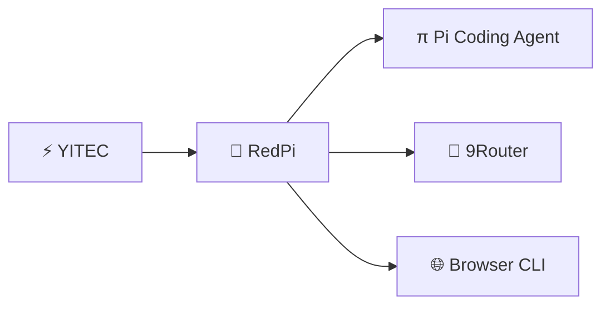
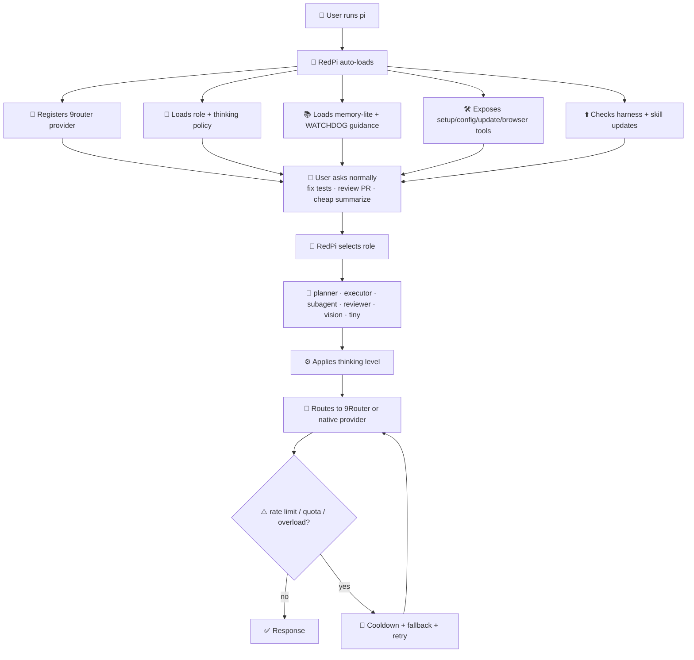
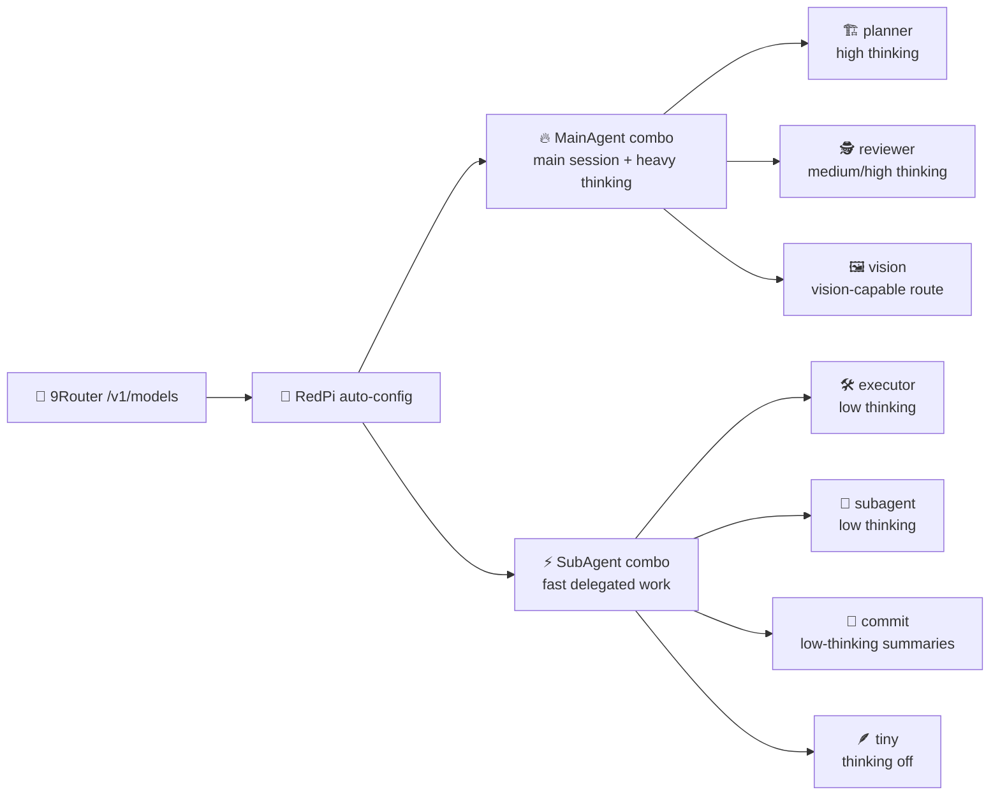
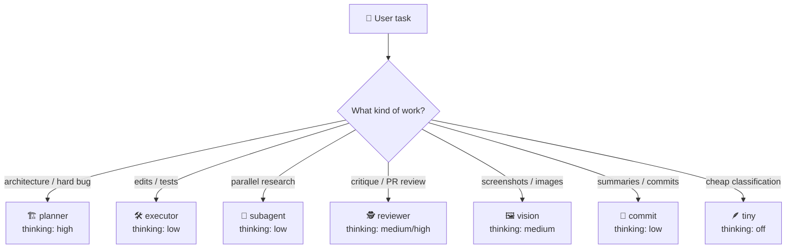
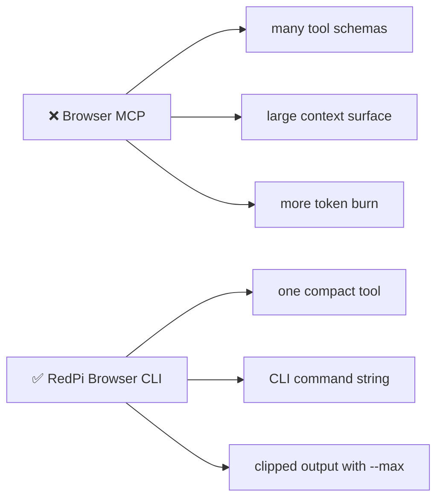
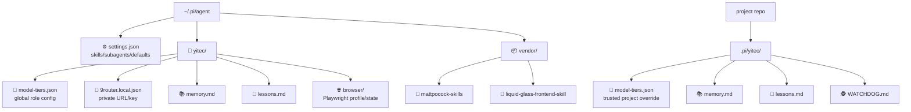

<div align="center">

```text
██████╗ ███████╗██████╗ ██████╗ ██╗
██╔══██╗██╔════╝██╔══██╗██╔══██╗██║
██████╔╝█████╗  ██║  ██║██████╔╝██║
██╔══██╗██╔══╝  ██║  ██║██╔═══╝ ██║
██║  ██║███████╗██████╔╝██║     ██║
╚═╝  ╚═╝╚══════╝╚═════╝ ╚═╝     ╚═╝
              powered by YITEC
```

</div>



### The install-once, auto-applied Pi harness for serious coding teams

**9Router · role-based thinking · subagents · skills · browser CLI · memory-lite · advisor-lite · auto-update**

[](./LICENSE)
[](https://github.com/ngocanhnckh/redpi)
[](https://github.com/decolua/9router)
[](#browser-automation-without-mcp)
[](https://github.com/ngocanhnckh/redpi)

---

## ✨ The promise

RedPi is designed so a teammate does **not** need to understand model routing, skills, browser tooling, subagents, memory files, or fallback policy before getting value.

```bash
curl -fsSL https://raw.githubusercontent.com/ngocanhnckh/redpi/main/install.sh | bash
pi
# RedPi automatically opens first-run provider onboarding
```

After that, daily use is simply:

```bash
pi
```

RedPi auto-loads and applies the best available harness defaults.

---

## 🧭 What happens after install?



RedPi is designed to **auto-create the best usable harness** from your available 9Router models and then apply it automatically on future `pi` starts.

---

## 🚀 Feature map

|  | Feature | Default behavior | User effort |
| --- | --- | --- | --- |
| 🔌 | **Auto-loaded harness** | Installed as a Pi package; normal `pi` startup loads RedPi. | None after install |
| 🧙 | **Automatic first-run setup** | The first `pi` launch asks which provider to authenticate; `/redpi-setup` remains available later. | Guided once |
| 🧠 | **9Router provider** | Registers native provider `9router` with OpenAI-compatible `/v1` API. | Paste URL/key once |
| 🎯 | **Auto 9Router role config** | Auto-generates planner/executor/reviewer/subagent roles from live `/models`. | Confirm once |
| ✳️ | **Claude subscription bridge** | Optional [pi-claude-bridge](https://github.com/elidickinson/pi-claude-bridge) provider: use a signed-in Claude Code subscription in Pi. | `/redpi-claude` |
| ⚙️ | **Thinking-aware routing** | Each role has its own thinking level: off/low/medium/high/etc. | Preconfigured |
| 🤖 | **Subagent defaults** | Installs `pi-subagents`; defaults cheap workers/scouts/reviewers. | None |
| 🧰 | **Skills** | Installs Matt Pocock skills, the liquid-glass frontend skill, and the RedPi Playwright browser skill. | None |
| 🌐 | **Browser automation** | One compact Playwright CLI tool, `redpi_browser`; console/errors/network/screenshot; no MCP overhead. Chromium installs with RedPi (opt out with `REDPI_SKIP_BROWSER=1`). | None |
| 🔁 | **Fallbacks** | Detects quota/rate/session/overload errors and retries via fallback chains. | Preconfigured |
| 📚 | **Memory-lite** | Reads capped project/global memory and lets the agent save lessons. | Optional |
| 🕵️ | **Advisor-lite** | Manual reviewer pass via `/yitec-review`; optional auto-review. | Optional |
| 🗺️ | **RedPlan + HQ** | `/redplan`: plan with you, approve in a web page (stories, Gantt, critical path, architecture, verified tech), then a named team of Pi worker sessions in tmux builds it while you watch a live board. | One command |
| 📊 | **Context display bar** | Shows approximate context usage in the Pi status bar during requests. | Automatic |
| ⬆️ | **Auto-update** | Checks harness and skill repos on session start. | None |
| 🔐 | **Public-safe** | No vault, no bundled secrets, no committed credentials. | Safer by default |

---

## ⚡ Quick start: easiest path

### 1. Install once

```bash
curl -fsSL https://raw.githubusercontent.com/ngocanhnckh/redpi/main/install.sh | bash
```

The installer:

- installs/updates Pi to avoid mixed dependency versions
- installs RedPi as a Pi package
- installs `pi-subagents`
- installs `pi-claude-bridge` for optional Claude Code subscription access
- installs Matt Pocock skills
- installs the liquid-glass frontend skill
- installs the superpowers subagent workflow skills (`subagent-driven-development` and friends)
- creates a default `MainAgent`/`SubAgent` routing config
- configures Pi skill discovery
- downloads Playwright Chromium for the `redpi_browser` tool and `redpi-browser` skill

Skip the browser download for a faster install:

```bash
curl -fsSL https://raw.githubusercontent.com/ngocanhnckh/redpi/main/install.sh | REDPI_SKIP_BROWSER=1 bash
```

Then install the browser later inside Pi:

```text
/redpi-browser-install
```

### 2. Start Pi

```bash
pi
```

You should see a compact startup banner:

```text
RedPi · powered by YITEC
```

If you want the full ASCII banner in the TUI, start Pi with:

```bash
REDPI_FULL_BANNER=1 pi
```

### 3. Complete automatic first-run onboarding

The first time you start Pi after installing RedPi, it automatically asks which provider you want:

```text
Welcome to RedPi — choose your provider
  9Router (recommended): MainAgent + SubAgent
  Claude Code subscription: Opus + Sonnet
  Other / configure later
```

Choose the 9Router option to continue into `/redpi-setup`, then choose:

```text
9Router login / connection
```

You can rerun the setup wizard later with `/redpi-setup`.

Paste:

```text
Base URL: https://9router.yitec.dev/v1
API key:  your key
```

When RedPi asks whether to auto-configure roles from 9Router, choose **yes**.

RedPi will then:

- fetch live 9Router models/combos
- prefer `MainAgent` combos for main/heavy-thinking roles when present
- prefer `SubAgent` combos for fast/subagent/executor roles when present
- ask whether you want to select a model/combo for each role immediately
- set Pi's default provider/model to `9router`
- save config under `~/.pi/agent/yitec/model-tiers.json`

Restart Pi or run:

```text
/reload
```

### 4. Daily use

```bash
pi
```

That's it.

---

## 🧙 Setup wizard

Run:

```text
/redpi-setup
```

You get a guided menu:

```text
RedPi setup
  9Router login / connection
  Install Playwright + Chromium
  Configure role models
  Check status
  Done
```

### 9Router login / connection

Stores private local config at:

```text
~/.pi/agent/yitec/9router.local.json
```

Permissions are set to `0600`.

Environment variables still override this file:

```bash
export NINE_ROUTER_BASE_URL=https://9router.yitec.dev/v1
export NINE_ROUTER_API_KEY=sk-...
```

Supported env var aliases:

```text
NINE_ROUTER_BASE_URL
ROUTER9_BASE_URL
NINE_ROUTER_API_KEY
ROUTER9_API_KEY
NINEROUTER_API_KEY
```

### 🎯 Auto-configure from live 9Router models

If `/v1/models` works, RedPi can create a best-effort role config automatically. If 9Router exposes named combos like `MainAgent` and `SubAgent`, RedPi uses them as first-class defaults:



After auto-detection, RedPi asks whether you want to choose the model/combo for each role right away. You can accept the recommended default for each role or pick any live 9Router model/combo.


Everything remains editable through:

```text
/redpi-config
```

---

## ⚙️ Role-based thinking

RedPi treats models as workers with jobs, not as a single global default.



|  | Role | Best for | Default thinking |
| --- | --- | --- | --- |
| 🏗️ | `planner` | architecture, plans, hard bugs | `high` |
| 🛠️ | `executor` | edits, tests, implementation | `low` |
| 🤖 | `subagent` | parallel cheap tasks | `low` |
| 🕵️ | `reviewer` | critique, safety, PR review | `medium` / `high` |
| 🖼️ | `vision` | screenshots/images | `medium` |
| 📝 | `commit` | commit messages, summaries | `low` |
| 🪶 | `tiny` | cheap summaries/classification | `off` |

Magic keywords can override behavior for a single turn:

```text
ultrathink design the migration before editing
cheap summarize this folder
orchestrate inspect auth, database, and frontend in parallel
```

### 📁 Strict role models for one folder

By default RedPi picks the planner model at the start of every turn and can fail over to other models. When a project needs exact models, open:

```text
/redpi-config
```

| Choice | Applies to | Behavior |
| --- | --- | --- |
| 📁 **This folder** | every new session in this folder and its subfolders | **strict**: only the models you set, no `MainAgent` default, no fallbacks or failover |
| ⏱ **This session only** | the current session | strict, forgotten when a new session starts |
| 🌐 **Global default** | folders without their own config | normal routing with tiers and fallbacks |
| 📦 **Project file** | `.pi/yitec/model-tiers.json` (trusted projects) | shared with the repo if committed |

Pick a role, choose its model and thinking level, repeat for other roles, then **💾 Save**. Roles you don't touch keep the model they currently resolve to, so the saved folder config is complete on its own.

- Folder configs are stored privately in `~/.pi/agent/yitec/folders/`, keyed by the folder path, so they need no project trust and never land in the repo.
- Subagent models for the folder are written to the folder's `.pi/settings.json`, the only per-project place pi-subagents reads.
- New sessions in the folder start directly on its planner model.
- `🔎 Show current routing` shows which config is active and the model for each role; `🗑 Remove this folder's config` returns the folder to the global defaults.

### 🛡 Preset profiles: Cybersecurity

`/redpi-config` → **🛡 Apply a preset profile** applies a ready-made strict role setup in one step. Choose where it applies (this folder, this session, global, or the project file), just like a hand-made config.

The **Cybersecurity** profile is tuned for security research and pentest work:

| Role | 9Router combo | Thinking |
| --- | --- | --- |
| `planner` | `OpenMed` | `high` |
| `executor` | `norail` | `high` |
| `subagent` | `norail` | `xhigh` |
| `reviewer` | `OpenMed` | `high` |
| `vision` | `OpenMed` | `high` |
| `commit` | `SubAgent` | `low` |
| `tiny` | `OpenSmall` | `off` |
| `default` | `norail` | `medium` |

> ⚠️ **Combo names must match exactly.** Presets point at 9Router combos by name, so they only work on a 9Router gateway that defines combos named **`OpenMed`**, **`norail`**, **`OpenSmall`**, and **`SubAgent`** (as the YITEC 9Router does). Names are case-sensitive. If your gateway names them differently, RedPi lists the missing combos and asks before applying; roles pointing at a missing combo fail until you create it. You can also apply the profile and then rename individual roles with `/redpi-config`.

Profiles are always strict: exactly these combos, no `MainAgent` default and no automatic failover. `🔎 Show current routing` shows which profile is active.

**Manual `/model` picks stick.** If you switch models with `/model` (or by cycling), RedPi pins that model for the rest of the session: it no longer switches back to the planner model on the next turn and does not fail over. Use `/redpi-config` → `▶ Resume role routing` to unpin.

---

## 🗺️ RedPlan: plan, approve, then run a team

```text
/redplan build a security triage assistant with LangChain Deep Agents and a Next.js UI
```

The Pi session you type this into becomes the **CEO**. It works in four phases:

1. **Intake.** If the request leaves decisions open, it uses Matt Pocock's `grill-me` skill and asks you one question at a time. If the request is already a clear spec or prototype, it skips straight to planning.
2. **Verify the technology.** Every library, framework, or service is checked against its real docs or package registry. The plan records the exact package, what is used from it, the source link, and what it is *not* ("LangChain Deep Agents" is the `deepagents` package and `create_deep_agent`, not "an agent that thinks deeply"). Anything unverified is flagged.
3. **Plan.** User stories with acceptance criteria, human-readable tasks with estimates and real dependencies, the architecture, and a proposed team. HQ validates it and computes the schedule, **critical path**, and what can run **in parallel**.
4. **Execute** (only after you approve). The CEO starts one **worker** per parallel lane: a full Pi session in tmux with a name and a role ("Alex, backend developer", "Peter, full-stack developer"). Each works in the shared folder or in its own git worktree and branch, whichever avoids collisions.

### The plan page

RedPi prints a link like `http://<this-machine>:47291/plans/<id>?t=…`. It shows expandable stories and tasks, a Gantt chart with the critical path in red, the parallel waves, an architecture diagram, and the tech stack with verification status. **Approve** or **Request changes** there; your comment goes straight back to the CEO, which revises and submits a new version.

### RedPi HQ dashboard

`/hq` prints the dashboard link. One hub serves every project on the machine, and every run has three views:

**🏢 Office** (default once workers exist): an animated pixel office where the team works.

- The CEO plans at the whiteboard, then leads from a glass office; each worker has a desk in a pod of four.
- Working people sit and type, their monitor lit; a bubble shows what they are doing right now (`$ pytest -q`, `> Report.tsx`, `< README.md`) or `...` while the model thinks.
- Idle people wander to the cafeteria and the meeting table.
- Anyone blocked, parked, rate-limited, or waiting on a prompt walks to the red **NEEDS YOU** mat by the door with a `!`.
- Every message flies as an envelope from sender to recipient (cyan chat, violet brief, amber decisions, red to or from you); messages to you land on the **YOU** terminal. A worker asking a teammate a question walks over to their desk.
- Finishing a task after real work (at least a minute busy) earns confetti.
- Name tags carry a context gauge. Click a person or desk to open them; drag to pan, scroll to zoom, double-click to reset.
- The whiteboard shows the live board as sticky notes, and the windows run Matrix rain.

**📋 Board**: the live Kanban (to do, in progress, review, blocked, done). Click a card for its full history: who moved it, when, and why.

**🕸 Graph**: who talks to whom. Edge width is message volume, recent conversations glow; drag to pin a node.

Around the views:

- a sticky **Needs you** strip: blocked tasks, workers that are offline, parked, rate-limited or waiting on a prompt, and questions addressed to you that you have not answered
- the **team** with pixel portraits; each worker's panel shows its tasks, context usage, latest message, a **tool waterfall** (one bar per tool call, width by duration, red if it failed), the activity feed, the `tmux attach` command, **Send** / **Interrupt + send**, and **Resume** when its session is gone
- the **team chat**, where workers ask each other directly, report to the CEO, and receive your messages

The office is drawn on a canvas that pauses when the tab is hidden, respects reduced motion (people move without walking, no flying envelopes), and is decorative for screen readers: the roster, board, and a live announcement region carry the same information.

### Reliability

- **Resume after a crash or reboot.** Each worker reports its Pi session file. `redplan_resume_worker` (or the dashboard's **Resume** button, which asks the CEO) relaunches it in tmux with `pi --session <file>`, so it keeps its whole conversation. Without a saved session it only starts fresh when asked, and then gets its original brief. Every launch has its own id, so a leftover process can never make a new one look alive.
- **Honest task closure.** Blocked needs a reason; done needs a note saying how it was verified; a handoff to a teammate needs a note on what is done and what is next, and happens atomically. Every change is kept in the task's history.
- **Independent review** (default). Builders move tasks to *review*; a separate reviewer worker checks the exact diff against the acceptance criteria and marks it done or sends it back with findings. Set `"review": "self"` in the plan to let builders close their own tasks.
- **Parked workers get nudged.** A worker that sits idle while owning in-progress work is nudged after 5 minutes, then the CEO is told, then it lands on your Needs-you strip (`REDPI_HQ_PARK_MS` changes the interval).
- **Needs input.** Workers report when a rate limit or quota stops them, or when a prompt is waiting in their terminal.
- **`/redplan-doctor`** checks HQ, the token, tmux, LAN reachability, and every worker's session, workspace, and saved session, with a fix for each problem.

Workers are real Pi sessions, not subagents: they keep running if the CEO is busy, you can attach to them (`tmux attach -t '=redpi-<run>-alex'`, detach with Ctrl-b d), and anything you or a teammate sends arrives in their session as a message. An interrupt stops the current turn first.

| Command | What it does |
| --- | --- |
| `/redplan <request>` | Start a run in this session (this session becomes the CEO) |
| `/redplan-status` | Plan status, board counts, blocked tasks, workers, links |
| `/redplan-stop` | Leave RedPlan mode in this session (workers and the run stay in HQ) |
| `/redplan-doctor` | Health check for HQ, tmux, and every worker, with fixes |
| `/hq` | Print the HQ dashboard link |

**No collisions between projects.** HQ is one small server (port **47291**) with one SQLite database in `~/.pi/agent/yitec/hq/`. Nothing is written into your projects except worktrees under `.redpi-worktrees/` (hidden from `git status` through `.git/info/exclude`) and the per-folder subagent settings. Every project, run, worker, and message has its own ID, so several projects, or several runs in one folder, run side by side.

**Security.** HQ listens on the LAN so you can open it from your laptop, and every request needs the token in `~/.pi/agent/yitec/hq/token`. Links RedPi prints carry it once and the browser keeps it in a cookie; changes also need a header that other websites cannot send. Anyone with the token can instruct your agents, which run commands as your user, so do not share links. Set `REDPI_HQ_HOST=127.0.0.1` to keep HQ local-only.

| Variable | Default | Purpose |
| --- | --- | --- |
| `REDPI_HQ_PORT` | `47291` | HQ port |
| `REDPI_HQ_HOST` | `0.0.0.0` | Interface HQ listens on |
| `REDPI_HQ_PUBLIC_HOST` | first LAN IPv4 | Host used in printed links |
| `REDPI_WORKER_ARGS` | (none) | Extra `pi` flags for worker sessions |

Requires `tmux` for workers.

---

## 🤖 Subagents

RedPi installs `pi-subagents` and configures practical defaults:

```text
oracle   → high-quality planning/research
reviewer → low-cost review pass
scout    → cheap discovery/search
worker   → cheap implementation/support
```

This is inspired by the useful subagent ergonomics in advanced Pi harnesses, but RedPi keeps the default setup simple and public-safe.

### Automatic subagents (on by default)

On its own, pi-subagents only delegates when you ask for it. RedPi turns on **automatic subagents** by default: it tells the agent it is authorized to spawn subagents without asking, and when it pays off:

- independent research or exploration across several areas → parallel scouts/researchers
- two or more independent tasks or problems → `dispatching-parallel-agents`, one child per task
- executing a written implementation plan with mostly independent tasks → `subagent-driven-development` (fresh implementer per task, review after each, final branch review)
- a separate reviewer subagent after a non-trivial implementation, before summarizing

For small, single-file, or tightly coupled changes the agent still works directly. Subagents run on the `subagent` role's model (for example `SubAgent`, or `norail` in the Cybersecurity profile), so automatic delegation means more model calls.

Turn it off or on with `/redpi-config` → `🤖 Automatic subagents`. The switch changes the active config: this session's, else this folder's, else the global one. When off, subagents run only when you ask, or with the `orchestrate` keyword:

```text
orchestrate review this PR. Send independent subagents to inspect auth, migrations, and frontend.
```

---

## 🧠 9Router integration

RedPi registers this provider:

```text
provider: 9router
api: openai-completions
base: https://your-9router/v1
```

RedPi lists **only 9Router combos** (models 9Router marks `owned_by: "combo"`), in Pi's `/model` list, `/redpi-config`, and the setup wizard. Raw provider routes such as `kr/…`, `cx/…`, or `nano/…` are hidden, so a gateway with hundreds of routes still shows a short, curated list.

```text
9router/MainAgent
9router/SubAgent
9router/<your-combo>
```

- Need a raw route anyway? Choose `✍️ manual entry` in the picker and type e.g. `9router/cx/gpt-5.6-terra`, or start Pi with `REDPI_9ROUTER_ALL_MODELS=1` to list everything (a search option appears on long lists).
- The model list is cached in `~/.pi/agent/yitec/9router-models.json`, so menus and startup still work when 9Router is slow to answer.

Check live status:

```text
/yitec-9router
```

---

## 🌐 Browser automation without MCP

RedPi includes optional Playwright browser automation, but intentionally avoids MCP because MCP can be context-heavy. The default RedPi install downloads Chromium using the package's own Playwright version. If you skipped it with `REDPI_SKIP_BROWSER=1`, `redpi_browser` prompts to install the runtime when first needed, or you can install it explicitly:

```text
/redpi-browser-install
```

Instead, RedPi exposes one compact tool:

```text
redpi_browser
```

That tool executes CLI-style commands:

```text
goto https://example.com --max 2000
text --max 3000
click text=Login
type input[name=q] "redpi 9router" --submit
wait-for-text "Dashboard loaded" --max 2000
console --max 3000
errors --max 3000
network --max 3000
html --max 2000
screenshot /tmp/redpi-page.png
reset
```

Frontend shortcut:

```text
/redpi-frontend-check http://localhost:3000
```

It opens the URL, captures page text, console errors, failed/4xx/5xx network responses, and saves a screenshot under `.pi/yitec/`.

Why this is efficient:




Browser state lives at:

```text
~/.pi/agent/yitec/browser/
```

Manual CLI use:

```bash
node scripts/redpi-browser.js goto https://example.com --max 1000
node scripts/redpi-browser.js text --max 3000
```

---

## 🧰 Skills included

RedPi adds skills to Pi settings automatically:

```text
~/.pi/agent/vendor/mattpocock-skills/skills/engineering
~/.pi/agent/vendor/mattpocock-skills/skills/productivity
~/.pi/agent/vendor/liquid-glass-frontend-skill
~/.pi/agent/vendor/superpowers/skills/<name>   (subagent workflow, see below)
<redpi package>/skills/redpi-browser   (Playwright browser skill)
```

From [obra/superpowers](https://github.com/obra/superpowers) (MIT), RedPi registers only the plan-and-subagent workflow: `subagent-driven-development`, `dispatching-parallel-agents`, `writing-plans`, `executing-plans`, `using-git-worktrees`, `requesting-code-review`, `finishing-a-development-branch`, and `verification-before-completion`. The rest of superpowers (its TDD, debugging, and `using-superpowers` meta-skill) is not registered, to avoid overlapping Matt Pocock's skills.

Examples:

```text
/skill:tdd implement this parser with tests
/skill:code-review review the current diff
/skill:domain-modeling design the order/payment model
```

Pi can also auto-select skills when the task matches their descriptions.

---

## 📚 Memory-lite

Project memory:

```text
.pi/yitec/memory.md
.pi/yitec/lessons.md
```

Global memory:

```text
~/.pi/agent/yitec/memory.md
~/.pi/agent/yitec/lessons.md
```

View memory:

```text
/yitec-memory
```

Save a lesson through the agent tool:

```text
yitec_remember
```

Memory is injected with a character cap and labeled as heuristic guidance, so the agent should verify it against the repo before relying on it.

---

## 🕵️ Advisor-lite and WATCHDOG.md

Run a reviewer pass:

```text
/yitec-review check this auth change for security regressions
```

Optional watchdog guidance files:

```text
~/.pi/agent/WATCHDOG.md
.pi/WATCHDOG.md
.pi/yitec/WATCHDOG.md
```

Enable auto-review in config if desired:

```json
{
  "advisor": {
    "enabled": true,
    "autoReview": true,
    "modelRole": "reviewer"
  }
}
```

---

## ✳️ Use your Claude Code subscription

RedPi includes [`pi-claude-bridge`](https://github.com/elidickinson/pi-claude-bridge), which uses the official locally signed-in Claude Code CLI via Anthropic's Agent SDK. It does **not** copy, store, or require an Anthropic API key.

1. Sign in once in a normal terminal:

   ```bash
   claude auth login --claudeai
   ```

2. Start Pi and run:

   ```text
   /redpi-claude
   ```

3. Select **Use Claude subscription: Opus + Sonnet**. To return at any time, run `/redpi-claude` and select **Use 9Router: MainAgent + SubAgent (1M context)**. RedPi snapshots each profile in `~/.pi/agent/yitec/provider-profiles.json`, so your role mappings survive switching. Or select a bridge model directly with `/model`:

   ```text
   claude-bridge/claude-opus-5
   claude-bridge/claude-sonnet-5
   ```

`/redpi-claude` can also enable the bridge's optional `AskClaude` delegation tool. The bridge uses your Claude Code subscription quota and its terms; it is independent of 9Router.

## 🎨 Visuals and context bar

RedPi ships and selects a complete Pi theme named `redpi-matrix`—not just a colored banner. It replaces the default purple/yellow UI tokens across borders, selection, Markdown, syntax highlighting, tool panels, diffs, thinking levels, and status surfaces with phosphor green, deep green, and signal cyan.

```text
◢ RedPi // YITEC SYSTEMS ONLINE
```

Preserve your existing Pi theme during installation with:

```bash
REDPI_THEME=0 curl -fsSL https://raw.githubusercontent.com/ngocanhnckh/redpi/main/install.sh | bash
```

Or select a different theme later in `/settings`.

It also shows a context status indicator during model requests:

```text
ctx █████░░░░░░░░░░░░░ 32,100/200k 16%
```

Optional display flags:

```bash
REDPI_FULL_BANNER=1 pi      # full ASCII logo in TUI
REDPI_COLOR=0 pi            # disable ANSI color in RedPi widgets
REDPI_CONTEXT_WIDGET=1 pi   # show a larger context widget above the editor
```

## ⌨️ Commands

|  | Command | Purpose |
| --- | --- | --- |
| 🧙 | `/redpi-setup` | Friendly TUI setup wizard for 9Router login, browser install/check, auto role config, and status. |
| 🧙 | `/yitec-setup` | Alias for `/redpi-setup`. |
| 🎯 | `/redpi-config` | Set role models and thinking for this folder (strict), this session, the project file, or globally; apply preset profiles (Cybersecurity); show or unpin routing. |
| 🎯 | `/yitec-config` | Alias for `/redpi-config`. |
| ⬆️ | `/redpi-update` | Force-update RedPi and vendored skill repos. |
| 🌐 | `/redpi-browser-install` | Install or reinstall the Playwright Chromium runtime. |
| 🖼️ | `/redpi-frontend-check` | Open a frontend URL and report page text, console/errors/network failures, and screenshot path. |
| ✳️ | `/redpi-claude` | Flexibly switch between Claude subscription (Opus/Sonnet) and 9Router MainAgent/SubAgent profiles. |
| ⬆️ | `/yitec-update` | Alias for `/redpi-update`. |
| 🧠 | `/yitec-9router` | Check 9Router provider, base URL, key presence, and live `/models`. |
| 📊 | `/yitec-tiers` | Print active model role/tier config. |
| 🩺 | `/yitec-doctor` | Validate role config, providers, and trust status. |
| 🤖 | `/yitec-agents` | Show subagent/reviewer/planner/executor model policy. |
| 📚 | `/yitec-memory` | Show local RedPi memory/lessons. |
| 🕵️ | `/yitec-review` | Run advisor-lite review using reviewer role. |

---

## 🗂️ Files RedPi manages




---

## ⚙️ Configuration example

Most users should use `/redpi-setup` and `/redpi-config`, not edit JSON manually.

```json
{
  "roles": {
    "planner": { "models": ["9router/cx/gpt-5.6-terra:high"], "thinking": "high" },
    "executor": { "models": ["9router/cx/gpt-5.6-terra:low"], "thinking": "low" },
    "subagent": { "models": ["9router/cx/gpt-5.6-terra:low"], "thinking": "low" },
    "reviewer": { "models": ["9router/cx/gpt-5.6-terra-review:medium"], "thinking": "medium" },
    "vision": { "models": ["9router/cx/gpt-5.6-terra:medium"], "thinking": "medium" },
    "tiny": { "models": ["9router/cx/gpt-5.6-terra:off"], "thinking": "off" }
  },
  "memory": { "enabled": true, "injectionCharLimit": 5000 },
  "autoUpdate": { "enabled": true, "intervalHours": 24 }
}
```

---

## ⬆️ Updates

RedPi checks for updates on session start, once per configured interval.

Force update:

```text
/redpi-update
```

Then restart Pi or run:

```text
/reload
```

---

## 🔐 Security model

RedPi is public-repo safe by design:

- no bundled secrets
- no public credential vault
- no web GUI server for private tokens
- 9Router key stored locally or via env vars
- browser profile stored under user-local Pi agent directory
- project config only loads after Pi trusts the project

Never commit:

```text
.env
API keys
OAuth tokens
models.json
9router.local.json
```

If a key appears in chat, logs, or a public issue, rotate it.

---

## ✅ Testing

From a checkout:

```bash
npm run smoke
npm pack --dry-run
```

Smoke coverage includes:

- automatic first-run provider onboarding
- core extension load
- commands/roles/memory in a real Pi TUI
- `/redpi-setup` one-shot flow in a real Pi TUI
- mocked 9Router `/v1/models`
- `MainAgent`/`SubAgent` auto-mapping
- local 9Router key file creation
- timeout settings patching
- guard that setup does not loop after success
- strict per-folder role config: saved, scoped subagents, global untouched, new sessions start on the folder planner
- manual `/model` picks stay pinned across turns
- Cybersecurity preset profile applies its exact combos strictly
- automatic subagents: on by default in the agent's system prompt, and the `/redpi-config` switch reaches the next request
- smoke tests run in a temporary Pi agent directory and never touch `~/.pi/agent`
- HQ API: plan validation, critical path and parallelism maths, token auth and CSRF header, approve / request-changes loop, workers, inbox, tasks
- RedPlan end to end: `/redplan` → plan → approval → three real Pi workers in tmux (shared folder, git worktree, independent reviewer) → board updates, teammate chat, reports to the CEO, human instructions, an interrupt that stops a running turn, the review gate, a crash + resume that keeps the worker's conversation, and a healthy doctor report
- HQ rules: closure reasons, review gate, task history, atomic handoffs, stale-launch guard, and the parked-worker ladder

Browser CLI test:

```bash
node scripts/redpi-browser.js reset
node scripts/redpi-browser.js goto https://example.com --max 500
```

Expected title:

```text
Example Domain
```

---

## ❓ FAQ

### Why do I see `simple-options.js does not provide an export named clampThinkingBudgetToAnswerRoom`?

That means your local Pi install is internally mismatched: one `@earendil-works/pi-ai` file was upgraded while another stayed old. It is a Pi package dependency issue, not a 9Router key problem.

Repair by reinstalling Pi/RedPi cleanly:

```bash
npm install -g --prefix "$HOME/.local" --force --ignore-scripts @earendil-works/pi-coding-agent@latest
curl -fsSL https://raw.githubusercontent.com/ngocanhnckh/redpi/main/install.sh | bash
```

Then restart:

```bash
pi
```

### Is RedPi a fork of Oh My Pi?

No. RedPi copies useful harness ideas, not private implementation wholesale. It focuses on a public-safe, install-once Pi package with 9Router routing and a smaller context footprint.

### Did RedPi copy Oh My Pi's model thinking selection?

RedPi implements the same category of feature: model choice is role-aware and thinking-aware. Roles can specify both model and thinking level, and `/redpi-config` lets users select thinking in the TUI.

### Did RedPi copy Oh My Pi's subagent ergonomics?

RedPi installs and configures `pi-subagents`, adds cheap role defaults, and encourages orchestration through the `orchestrate` magic keyword. It does not blindly clone every Oh My Pi subagent feature; it keeps defaults simple and maintainable.

### Why no MCP browser?

Because browser MCP servers can add large tool schemas and context overhead. RedPi uses a single CLI-backed tool with clipped output.

### Can I use native Pi `/login` instead of 9Router?

Yes. RedPi supports native providers and 9Router. 9Router is recommended for team routing/combos.

---

## 🙏 Credits

- The RedPi Office engine (pixel people, walking, camera, bubbles, envelopes, desk screens), the communication-graph layout, and the tool waterfall are ported from [munder-difflin](https://github.com/chaitanyagiri/munder-difflin) (MIT), which builds on [the-office](https://github.com/shahar061/the-office) (ISC). The office room, furniture, and layout are original RedPi art drawn in code: munder-difflin's LimeZu tilesets are not redistributable and are not included.
- Worker resume, launch ids, closure reasons and handoffs, parked detection with a wake ladder, the doctor check, and the independent-review norms are adapted from designs in [OpenRig](https://github.com/mvschwarz/openrig) (Apache-2.0).
- Plan-and-subagent workflow skills from [obra/superpowers](https://github.com/obra/superpowers) (MIT) and skills from [Matt Pocock](https://github.com/mattpocock/skills).

See [`NOTICE`](./NOTICE) for licenses and details.

---

## 📍 Repository

```text
https://github.com/ngocanhnckh/redpi
```

## 📄 License

MIT
