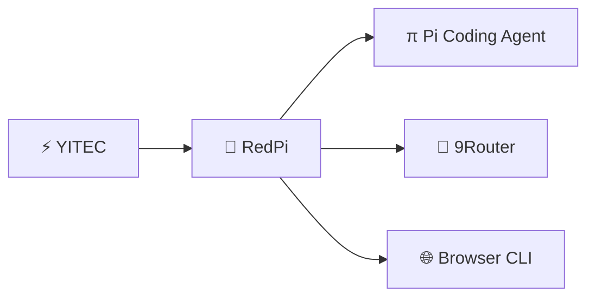
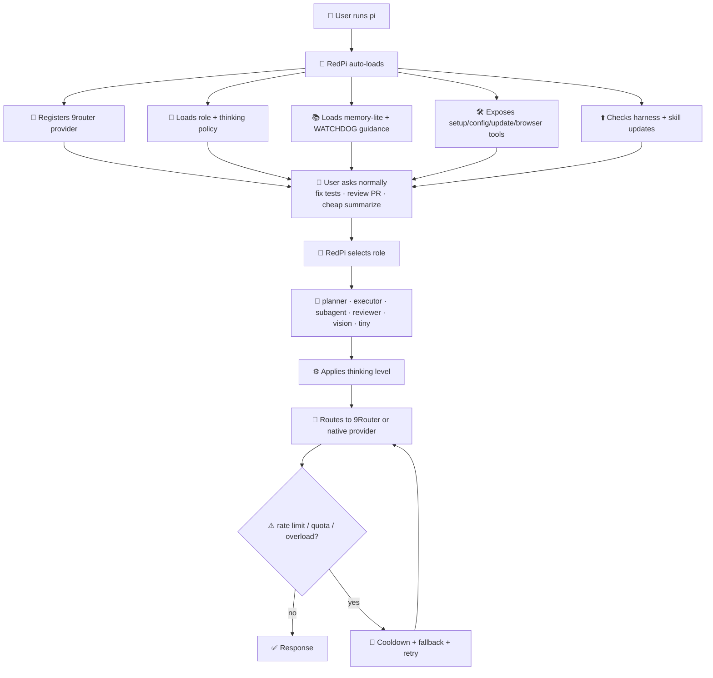
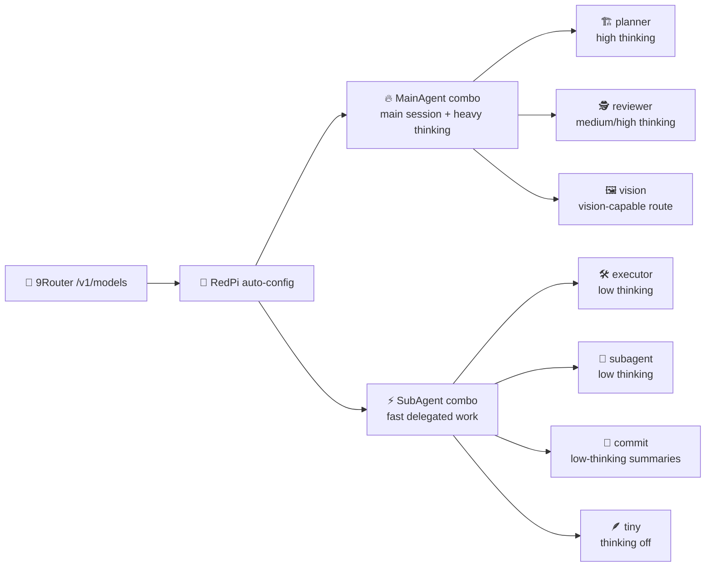
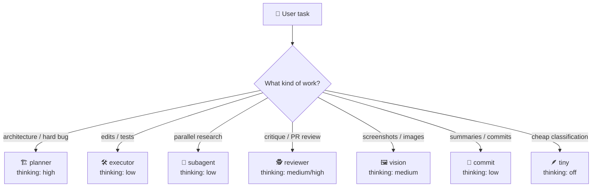
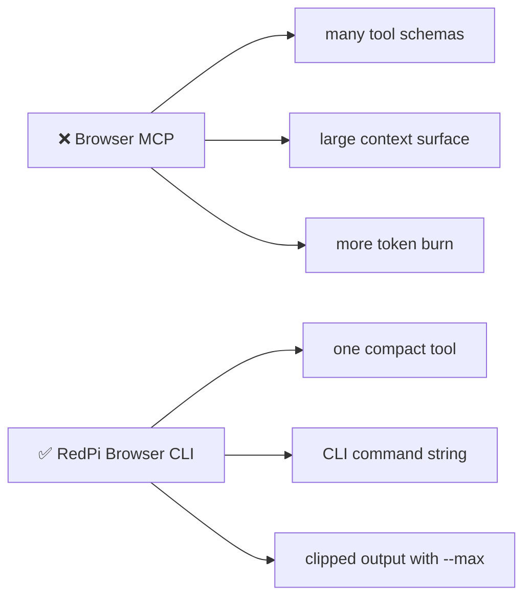
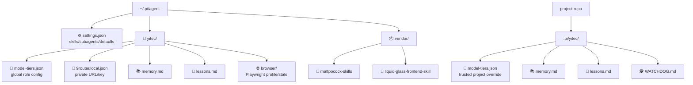

<div align="center">

```text
██████╗ ███████╗██████╗ ██████╗ ██╗
██╔══██╗██╔════╝██╔══██╗██╔══██╗██║
██████╔╝█████╗  ██║  ██║██████╔╝██║
██╔══██╗██╔══╝  ██║  ██║██╔═══╝ ██║
██║  ██║███████╗██████╔╝██║     ██║
╚═╝  ╚═╝╚══════╝╚═════╝ ╚═╝     ╚═╝
              powered by YITEC
```

</div>



### The install-once, auto-applied Pi harness for serious coding teams

**9Router · role-based thinking · subagents · skills · browser CLI · memory-lite · advisor-lite · auto-update**

[](./LICENSE)
[](https://github.com/ngocanhnckh/redpi)
[](https://github.com/decolua/9router)
[](#browser-automation-without-mcp)
[](https://github.com/ngocanhnckh/redpi)

---

## ✨ The promise

RedPi is designed so a teammate does **not** need to understand model routing, skills, browser tooling, subagents, memory files, or fallback policy before getting value.

```bash
curl -fsSL https://raw.githubusercontent.com/ngocanhnckh/redpi/main/install.sh | bash
pi
/redpi-setup
```

After that, daily use is simply:

```bash
pi
```

RedPi auto-loads and applies the best available harness defaults.

---

## 🧭 What happens after install?



RedPi is designed to **auto-create the best usable harness** from your available 9Router models and then apply it automatically on future `pi` starts.

---

## 🚀 Feature map

|  | Feature | Default behavior | User effort |
| --- | --- | --- | --- |
| 🔌 | **Auto-loaded harness** | Installed as a Pi package; normal `pi` startup loads RedPi. | None after install |
| 🧙 | **Friendly setup TUI** | `/redpi-setup` walks through 9Router login, browser install, status, and role config. | One command |
| 🧠 | **9Router provider** | Registers native provider `9router` with OpenAI-compatible `/v1` API. | Paste URL/key once |
| 🎯 | **Auto 9Router role config** | Auto-generates planner/executor/reviewer/subagent roles from live `/models`. | Confirm once |
| ⚙️ | **Thinking-aware routing** | Each role has its own thinking level: off/low/medium/high/etc. | Preconfigured |
| 🤖 | **Subagent defaults** | Installs `pi-subagents`; defaults cheap workers/scouts/reviewers. | None |
| 🧰 | **Skills** | Installs Matt Pocock skills and liquid-glass frontend skill. | None |
| 🌐 | **Browser automation** | One compact Playwright CLI tool, `redpi_browser`; no MCP overhead. | Auto-installed |
| 🔁 | **Fallbacks** | Detects quota/rate/session/overload errors and retries via fallback chains. | Preconfigured |
| 📚 | **Memory-lite** | Reads capped project/global memory and lets the agent save lessons. | Optional |
| 🕵️ | **Advisor-lite** | Manual reviewer pass via `/yitec-review`; optional auto-review. | Optional |
| ⬆️ | **Auto-update** | Checks harness and skill repos on session start. | None |
| 🔐 | **Public-safe** | No vault, no bundled secrets, no committed credentials. | Safer by default |

---

## ⚡ Quick start: easiest path

### 1. Install once

```bash
curl -fsSL https://raw.githubusercontent.com/ngocanhnckh/redpi/main/install.sh | bash
```

The installer:

- installs Pi if missing
- installs RedPi as a Pi package
- installs `pi-subagents`
- installs Matt Pocock skills
- installs the liquid-glass frontend skill
- creates a default model routing config
- installs Playwright Chromium for browser automation
- configures Pi skill discovery

Skip browser install only if needed:

```bash
REDPI_SKIP_BROWSER_INSTALL=1 curl -fsSL https://raw.githubusercontent.com/ngocanhnckh/redpi/main/install.sh | bash
```

### 2. Start Pi

```bash
pi
```

You should see a compact startup banner:

```text
RedPi · powered by YITEC
```

If you want the full ASCII banner in the TUI, start Pi with:

```bash
REDPI_FULL_BANNER=1 pi
```

### 3. Run the setup wizard

```text
/redpi-setup
```

Choose:

```text
9Router login / connection
```

Paste:

```text
Base URL: https://9router.yitec.dev/v1
API key:  your key
```

When RedPi asks whether to auto-configure roles from 9Router, choose **yes**.

RedPi will then:

- fetch live 9Router models/combos
- prefer `MainAgent` combos for main/heavy-thinking roles when present
- prefer `SubAgent` combos for fast/subagent/executor roles when present
- ask whether you want to select a model/combo for each role immediately
- set Pi's default provider/model to `9router`
- save config under `~/.pi/agent/yitec/model-tiers.json`

Restart Pi or run:

```text
/reload
```

### 4. Daily use

```bash
pi
```

That's it.

---

## 🧙 Setup wizard

Run:

```text
/redpi-setup
```

You get a guided menu:

```text
RedPi setup
  9Router login / connection
  Install Playwright + Chromium
  Configure role models
  Check status
  Done
```

### 9Router login / connection

Stores private local config at:

```text
~/.pi/agent/yitec/9router.local.json
```

Permissions are set to `0600`.

Environment variables still override this file:

```bash
export NINE_ROUTER_BASE_URL=https://9router.yitec.dev/v1
export NINE_ROUTER_API_KEY=sk-...
```

Supported env var aliases:

```text
NINE_ROUTER_BASE_URL
ROUTER9_BASE_URL
NINE_ROUTER_API_KEY
ROUTER9_API_KEY
NINEROUTER_API_KEY
```

### 🎯 Auto-configure from live 9Router models

If `/v1/models` works, RedPi can create a best-effort role config automatically. If 9Router exposes named combos like `MainAgent` and `SubAgent`, RedPi uses them as first-class defaults:



After auto-detection, RedPi asks whether you want to choose the model/combo for each role right away. You can accept the recommended default for each role or pick any live 9Router model/combo.


Everything remains editable through:

```text
/redpi-config
```

---

## ⚙️ Role-based thinking

RedPi treats models as workers with jobs, not as a single global default.



|  | Role | Best for | Default thinking |
| --- | --- | --- | --- |
| 🏗️ | `planner` | architecture, plans, hard bugs | `high` |
| 🛠️ | `executor` | edits, tests, implementation | `low` |
| 🤖 | `subagent` | parallel cheap tasks | `low` |
| 🕵️ | `reviewer` | critique, safety, PR review | `medium` / `high` |
| 🖼️ | `vision` | screenshots/images | `medium` |
| 📝 | `commit` | commit messages, summaries | `low` |
| 🪶 | `tiny` | cheap summaries/classification | `off` |

Magic keywords can override behavior for a single turn:

```text
ultrathink design the migration before editing
cheap summarize this folder
orchestrate inspect auth, database, and frontend in parallel
```

---

## 🤖 Subagents

RedPi installs `pi-subagents` and configures practical defaults:

```text
oracle   → high-quality planning/research
reviewer → low-cost review pass
scout    → cheap discovery/search
worker   → cheap implementation/support
```

This is inspired by the useful subagent ergonomics in advanced Pi harnesses, but RedPi keeps the default setup simple and public-safe.

Use naturally:

```text
orchestrate review this PR. Send independent subagents to inspect auth, migrations, and frontend.
```

RedPi tells the agent to prefer cheap/parallel delegation where it helps.

---

## 🧠 9Router integration

RedPi registers this provider:

```text
provider: 9router
api: openai-completions
base: https://your-9router/v1
```

Model IDs look like:

```text
9router/<model-or-combo-id>
```

Examples:

```text
9router/cx/gpt-5.6-terra
9router/cx/gpt-5.6-terra-review
9router/kr/auto
9router/kr/claude-sonnet-4.5
```

Check live status:

```text
/yitec-9router
```

---

## 🌐 Browser automation without MCP

RedPi includes Playwright browser automation, but intentionally avoids MCP because MCP can be context-heavy.

Instead, RedPi exposes one compact tool:

```text
redpi_browser
```

That tool executes CLI-style commands:

```text
goto https://example.com --max 2000
text --max 3000
click text=Login
type input[name=q] "redpi 9router" --submit
html --max 2000
screenshot /tmp/redpi-page.png
reset
```

Why this is efficient:




Browser state lives at:

```text
~/.pi/agent/yitec/browser/
```

Manual CLI use:

```bash
node scripts/redpi-browser.js goto https://example.com --max 1000
node scripts/redpi-browser.js text --max 3000
```

---

## 🧰 Skills included

RedPi adds skills to Pi settings automatically:

```text
~/.pi/agent/vendor/mattpocock-skills/.agents/skills
~/.pi/agent/vendor/liquid-glass-frontend-skill
```

Examples:

```text
/skill:tdd implement this parser with tests
/skill:code-review review the current diff
/skill:domain-modeling design the order/payment model
```

Pi can also auto-select skills when the task matches their descriptions.

---

## 📚 Memory-lite

Project memory:

```text
.pi/yitec/memory.md
.pi/yitec/lessons.md
```

Global memory:

```text
~/.pi/agent/yitec/memory.md
~/.pi/agent/yitec/lessons.md
```

View memory:

```text
/yitec-memory
```

Save a lesson through the agent tool:

```text
yitec_remember
```

Memory is injected with a character cap and labeled as heuristic guidance, so the agent should verify it against the repo before relying on it.

---

## 🕵️ Advisor-lite and WATCHDOG.md

Run a reviewer pass:

```text
/yitec-review check this auth change for security regressions
```

Optional watchdog guidance files:

```text
~/.pi/agent/WATCHDOG.md
.pi/WATCHDOG.md
.pi/yitec/WATCHDOG.md
```

Enable auto-review in config if desired:

```json
{
  "advisor": {
    "enabled": true,
    "autoReview": true,
    "modelRole": "reviewer"
  }
}
```

---

## ⌨️ Commands

|  | Command | Purpose |
| --- | --- | --- |
| 🧙 | `/redpi-setup` | Friendly TUI setup wizard for 9Router login, browser install/check, auto role config, and status. |
| 🧙 | `/yitec-setup` | Alias for `/redpi-setup`. |
| 🎯 | `/redpi-config` | TUI role/model configurator. Pick live 9Router models/combos and thinking levels. |
| 🎯 | `/yitec-config` | Alias for `/redpi-config`. |
| ⬆️ | `/redpi-update` | Force-update RedPi and vendored skill repos. |
| ⬆️ | `/yitec-update` | Alias for `/redpi-update`. |
| 🧠 | `/yitec-9router` | Check 9Router provider, base URL, key presence, and live `/models`. |
| 📊 | `/yitec-tiers` | Print active model role/tier config. |
| 🩺 | `/yitec-doctor` | Validate role config, providers, and trust status. |
| 🤖 | `/yitec-agents` | Show subagent/reviewer/planner/executor model policy. |
| 📚 | `/yitec-memory` | Show local RedPi memory/lessons. |
| 🕵️ | `/yitec-review` | Run advisor-lite review using reviewer role. |

---

## 🗂️ Files RedPi manages




---

## ⚙️ Configuration example

Most users should use `/redpi-setup` and `/redpi-config`, not edit JSON manually.

```json
{
  "roles": {
    "planner": { "models": ["9router/cx/gpt-5.6-terra:high"], "thinking": "high" },
    "executor": { "models": ["9router/cx/gpt-5.6-terra:low"], "thinking": "low" },
    "subagent": { "models": ["9router/cx/gpt-5.6-terra:low"], "thinking": "low" },
    "reviewer": { "models": ["9router/cx/gpt-5.6-terra-review:medium"], "thinking": "medium" },
    "vision": { "models": ["9router/cx/gpt-5.6-terra:medium"], "thinking": "medium" },
    "tiny": { "models": ["9router/cx/gpt-5.6-terra:off"], "thinking": "off" }
  },
  "memory": { "enabled": true, "injectionCharLimit": 5000 },
  "autoUpdate": { "enabled": true, "intervalHours": 24 }
}
```

---

## ⬆️ Updates

RedPi checks for updates on session start, once per configured interval.

Force update:

```text
/redpi-update
```

Then restart Pi or run:

```text
/reload
```

---

## 🔐 Security model

RedPi is public-repo safe by design:

- no bundled secrets
- no public credential vault
- no web GUI server for private tokens
- 9Router key stored locally or via env vars
- browser profile stored under user-local Pi agent directory
- project config only loads after Pi trusts the project

Never commit:

```text
.env
API keys
OAuth tokens
models.json
9router.local.json
```

If a key appears in chat, logs, or a public issue, rotate it.

---

## ✅ Testing

From a checkout:

```bash
./scripts/smoke-test.sh
npm pack --dry-run
```

Browser CLI test:

```bash
node scripts/redpi-browser.js reset
node scripts/redpi-browser.js goto https://example.com --max 500
```

Expected title:

```text
Example Domain
```

---

## ❓ FAQ

### Is RedPi a fork of Oh My Pi?

No. RedPi copies useful harness ideas, not private implementation wholesale. It focuses on a public-safe, install-once Pi package with 9Router routing and a smaller context footprint.

### Did RedPi copy Oh My Pi's model thinking selection?

RedPi implements the same category of feature: model choice is role-aware and thinking-aware. Roles can specify both model and thinking level, and `/redpi-config` lets users select thinking in the TUI.

### Did RedPi copy Oh My Pi's subagent ergonomics?

RedPi installs and configures `pi-subagents`, adds cheap role defaults, and encourages orchestration through the `orchestrate` magic keyword. It does not blindly clone every Oh My Pi subagent feature; it keeps defaults simple and maintainable.

### Why no MCP browser?

Because browser MCP servers can add large tool schemas and context overhead. RedPi uses a single CLI-backed tool with clipped output.

### Can I use native Pi `/login` instead of 9Router?

Yes. RedPi supports native providers and 9Router. 9Router is recommended for team routing/combos.

---

## 📍 Repository

```text
https://github.com/ngocanhnckh/redpi
```

## 📄 License

MIT
